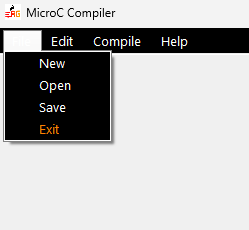
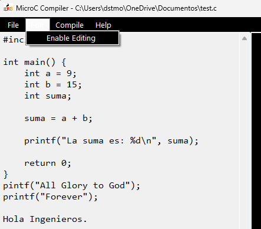

# PRE-COMPILADOR v2.0 MicroC

## Información del Estudiante

**Nombre:** Davids Morales  
**Carné:** 202425503  
**Curso:** Autómatas y Lenguajes  
**Proyecto:** Compilador MicroC (Segunda Parte) 

---

## Descripción del Proyecto

Este proyecto consiste en el desarrollo de un Pre-Compilador MicroC implementado en C# utilizando Windows Forms, Visual Studio 2022.

El sistema permite abrir archivos ".c", editar, guardar y crear nuevos archivos. Al seguir los pasos indicados en la documentación y al presionar el botón compilar, mostrará este formato (Linea | Lexema | Token) cada uno de forma ordenada para comprender mejor como se separa cada elemento que se escribirá en el cuadro de texto izquierdo. 

Entre las funcionalidades implementadas se encuentran:

- Apertura y guardado de archivos (.c)
- Bloqueo y desbloqueo de edición
- Interfaz gráfica amigable para el usuario
- Identificación de tokens
- Análisis Léxico

---

## Tecnologías Utilizadas

- C#
- .NET Framework
- Windows Forms
- Visual Studio 2022/2026
- Git y GitHub

---

## Instrucciones de Ejecución

1. Clonar el repositorio:

git clone https://github.com/davidsmorales9/Compilador-MicroC-DavidsMorales.git

2. Abrir el archivo `.sln` ubicado en la carpeta `/src`.

3. Ejecutar el proyecto desde Visual Studio 2022.

4. Presionar el ejecutable MicroC Compiler.

5. ¡Listo!

---

## Capturas de Pantalla

### Interfaz Inicial

### Interfaz Principal

### Menú File

### Edición Habilitada

### Salir

---

## Video Demostrativo

Enlace al video donde se muestran las funcionalidades implementadas:

https://youtu.be/OA0EIpsrN6c?si=MEhY_39o2l3v7k5s