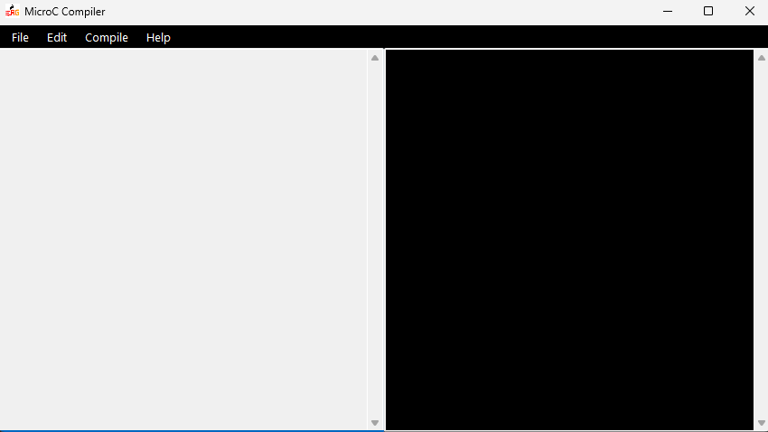
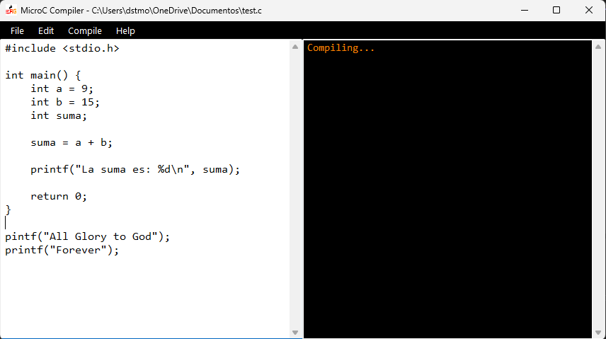
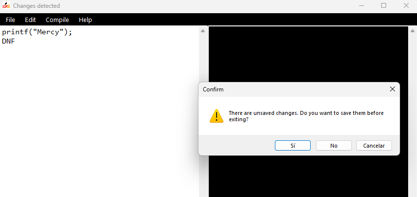

# PRE-COMPILADOR MicroC

## Información del Estudiante

**Nombre:** Davids Morales  

**Carné:** 202425503  

**Curso:** Autómatas y Lenguajes  

**Proyecto:** Compilador MicroC  

---

## Descripción del Proyecto

Este proyecto consiste en el desarrollo de un Pre-Compilador MicroC implementado en C# utilizando Windows Forms, Visual Studio 2022.

El sistema permite abrir archivos ".c", editar, guardar y crear nuevos archivos. Muestra el mensaje de compilación (función no desarrollada aún).

Entre las funcionalidades implementadas se encuentran:

- Apertura y guardado de archivos (.c)

- Bloqueo y desbloqueo de edición

- Interfaz gráfica amigable para el usuario

---

## Tecnologías Utilizadas

- C#

- .NET Framework

- Windows Forms

- Visual Studio 2022

- Git y GitHub

---

## Instrucciones de Ejecución

1. Clonar el repositorio:

git clone https://github.com/davidsmorales9/Compilador-MicroC-DavidsMorales.git

---

2. Abrir el archivo `.sln` ubicado en la carpeta `/src`.

3. Ejecutar el proyecto desde Visual Studio 2022.

4. Presionar el ejecutable MicroC Compiler.

5. ¡Listo!

---

## Capturas de Pantalla

### Interfaz Inicial

### Interfaz Principal

### Menú File

### Edición Habilitada

### Salir

---

## Video Demostrativo

Enlace al video donde se muestran las funcionalidades implementadas:

https://youtu.be/84Nf7JDW0Vc?si=mXmoUFdgd72gIT2d

